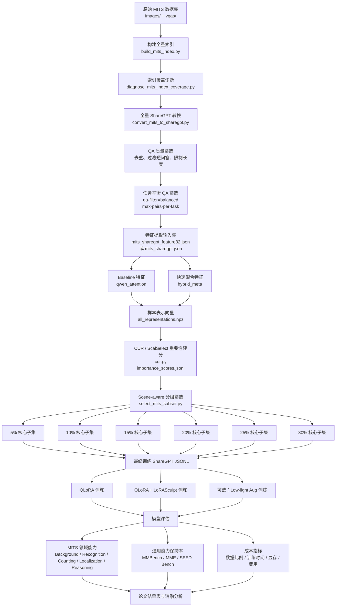
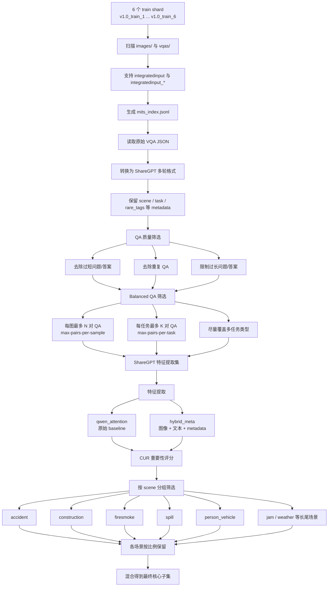
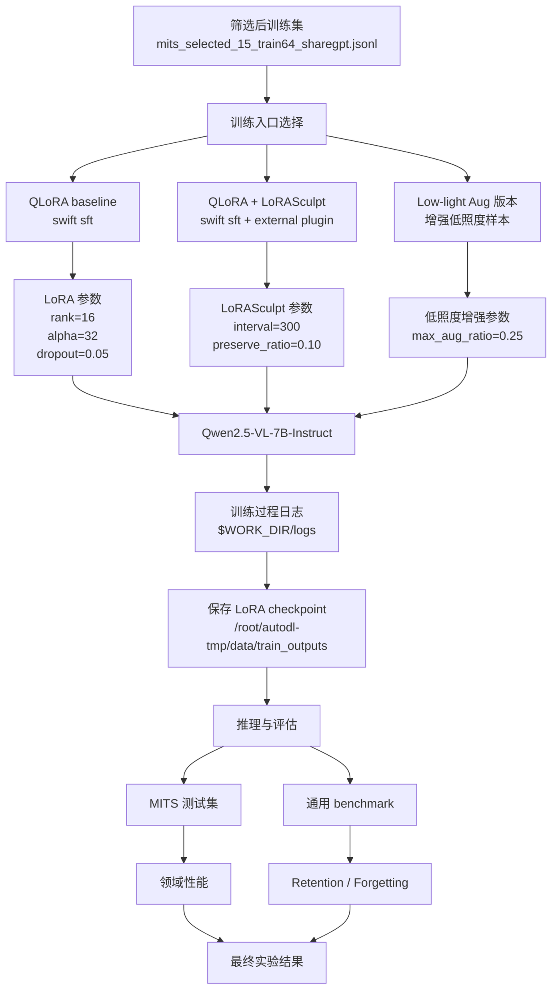
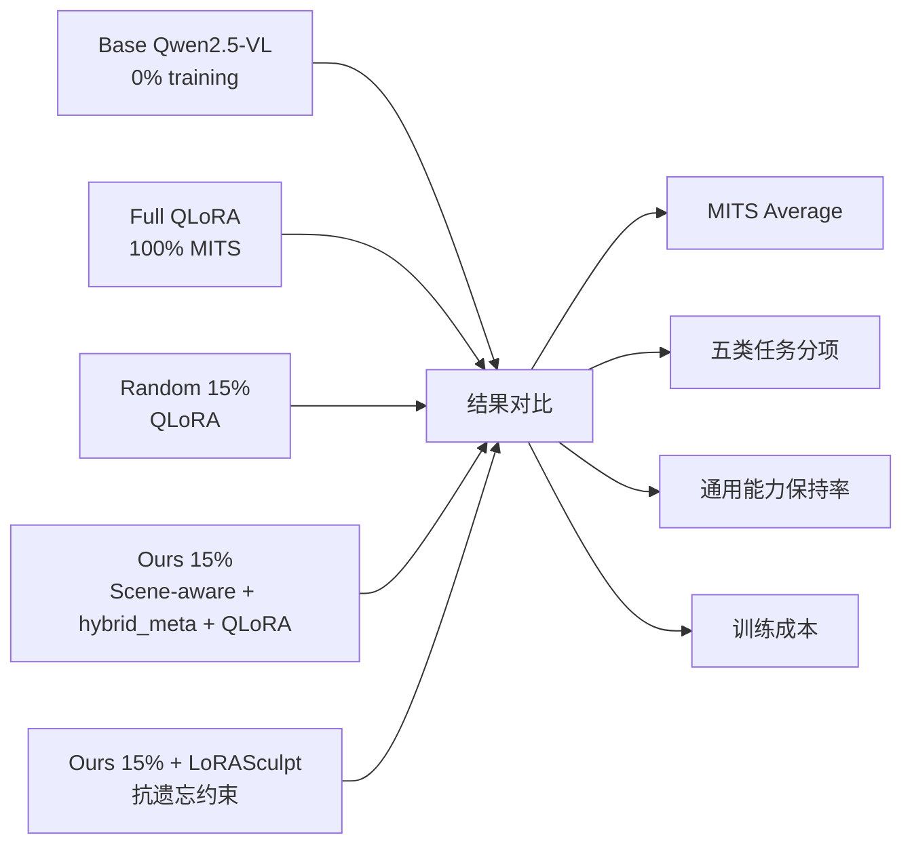
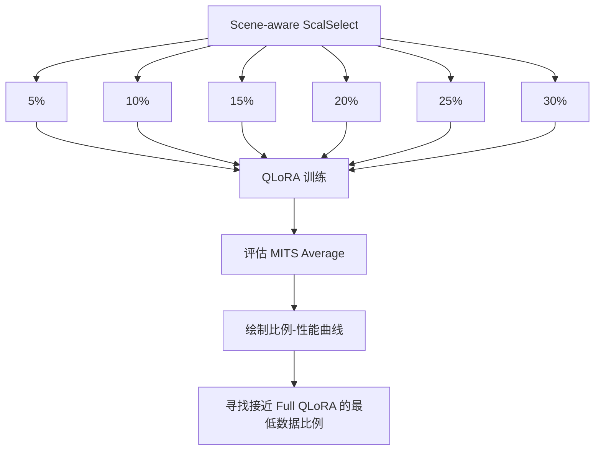
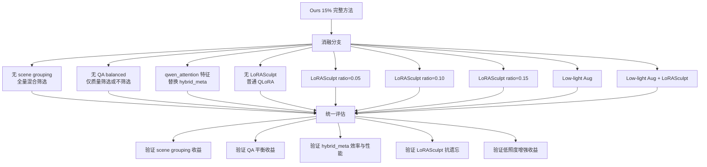
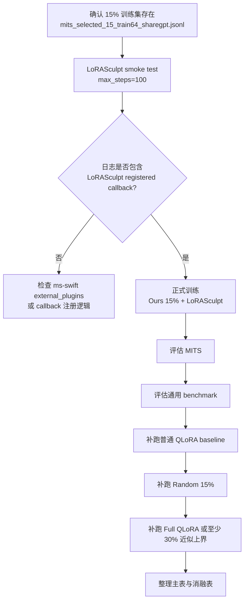
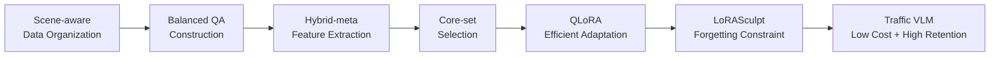

# MITS 论文实验流程图

日期：2026-05-23

## 1. 总体流程

```mermaid
flowchart TD
    A["原始 MITS 数据集<br/>images/ + vqas/"] --> B["构建全量索引<br/>build_mits_index.py"]
    B --> C["索引覆盖诊断<br/>diagnose_mits_index_coverage.py"]
    C --> D["全量 ShareGPT 转换<br/>convert_mits_to_sharegpt.py"]

    D --> E["QA 质量筛选<br/>去重、过滤短问答、限制长度"]
    E --> F["任务平衡 QA 筛选<br/>qa-filter=balanced<br/>max-pairs-per-task"]
    F --> G["特征提取输入集<br/>mits_sharegpt_feature32.json<br/>或 mits_sharegpt.json"]

    G --> H1["Baseline 特征<br/>qwen_attention"]
    G --> H2["快速混合特征<br/>hybrid_meta"]

    H1 --> I["样本表示向量<br/>all_representations.npz"]
    H2 --> I

    I --> J["CUR / ScalSelect 重要性评分<br/>cur.py<br/>importance_scores.jsonl"]
    J --> K["Scene-aware 分组筛选<br/>select_mits_subset.py"]

    K --> L1["5% 核心子集"]
    K --> L2["10% 核心子集"]
    K --> L3["15% 核心子集"]
    K --> L4["20% 核心子集"]
    K --> L5["25% 核心子集"]
    K --> L6["30% 核心子集"]

    L1 --> M["最终训练 ShareGPT JSONL"]
    L2 --> M
    L3 --> M
    L4 --> M
    L5 --> M
    L6 --> M

    M --> N1["QLoRA 训练"]
    M --> N2["QLoRA + LoRASculpt 训练"]
    M --> N3["可选：Low-light Aug 训练"]

    N1 --> O["模型评估"]
    N2 --> O
    N3 --> O

    O --> P1["MITS 领域能力<br/>Background / Recognition / Counting / Localization / Reasoning"]
    O --> P2["通用能力保持率<br/>MMBench / MME / SEED-Bench"]
    O --> P3["成本指标<br/>数据比例 / 训练时间 / 显存 / 费用"]

    P1 --> Q["论文结果表与消融分析"]
    P2 --> Q
    P3 --> Q
```

## 2. 数据构建与筛选流程

```mermaid
flowchart TD
    A["6 个 train shard<br/>v1.0_train_1 ... v1.0_train_6"] --> B["扫描 images/ 与 vqas/"]
    B --> C["支持 integratedinput 与 integratedinput_*"]
    C --> D["生成 mits_index.jsonl"]

    D --> E["读取原始 VQA JSON"]
    E --> F["转换为 ShareGPT 多轮格式"]
    F --> G["保留 scene / task / rare_tags 等 metadata"]

    G --> H["QA 质量筛选"]
    H --> H1["去除过短问题/答案"]
    H --> H2["去除重复 QA"]
    H --> H3["限制过长问题/答案"]

    H1 --> I["Balanced QA 筛选"]
    H2 --> I
    H3 --> I

    I --> I1["每图最多 N 对 QA<br/>max-pairs-per-sample"]
    I --> I2["每任务最多 K 对 QA<br/>max-pairs-per-task"]
    I --> I3["尽量覆盖多任务类型"]

    I1 --> J["ShareGPT 特征提取集"]
    I2 --> J
    I3 --> J

    J --> K["特征提取"]
    K --> K1["qwen_attention<br/>原始 baseline"]
    K --> K2["hybrid_meta<br/>图像 + 文本 + metadata"]

    K1 --> L["CUR 重要性评分"]
    K2 --> L

    L --> M["按 scene 分组筛选"]
    M --> M1["accident"]
    M --> M2["construction"]
    M --> M3["firesmoke"]
    M --> M4["spill"]
    M --> M5["person_vehicle"]
    M --> M6["jam / weather 等长尾场景"]

    M1 --> N["各场景按比例保留"]
    M2 --> N
    M3 --> N
    M4 --> N
    M5 --> N
    M6 --> N

    N --> O["混合得到最终核心子集"]
```

## 3. 训练流程

```mermaid
flowchart TD
    A["筛选后训练集<br/>mits_selected_15_train64_sharegpt.jsonl"] --> B["训练入口选择"]

    B --> C1["QLoRA baseline<br/>swift sft"]
    B --> C2["QLoRA + LoRASculpt<br/>swift sft + external plugin"]
    B --> C3["Low-light Aug 版本<br/>增强低照度样本"]

    C1 --> D1["LoRA 参数<br/>rank=16<br/>alpha=32<br/>dropout=0.05"]
    C2 --> D2["LoRASculpt 参数<br/>interval=300<br/>preserve_ratio=0.10"]
    C3 --> D3["低照度增强参数<br/>max_aug_ratio=0.25"]

    D1 --> E["Qwen2.5-VL-7B-Instruct"]
    D2 --> E
    D3 --> E

    E --> F["训练过程日志<br/>$WORK_DIR/logs"]
    F --> G["保存 LoRA checkpoint<br/>/root/autodl-tmp/data/train_outputs"]

    G --> H["推理与评估"]
    H --> I1["MITS 测试集"]
    H --> I2["通用 benchmark"]

    I1 --> J1["领域性能"]
    I2 --> J2["Retention / Forgetting"]

    J1 --> K["最终实验结果"]
    J2 --> K
```

## 4. 主实验设计

```mermaid
flowchart LR
    A["Base Qwen2.5-VL<br/>0% training"] --> Z["结果对比"]
    B["Full QLoRA<br/>100% MITS"] --> Z
    C["Random 15%<br/>QLoRA"] --> Z
    D["Ours 15%<br/>Scene-aware + hybrid_meta + QLoRA"] --> Z
    E["Ours 15% + LoRASculpt<br/>抗遗忘约束"] --> Z

    Z --> M1["MITS Average"]
    Z --> M2["五类任务分项"]
    Z --> M3["通用能力保持率"]
    Z --> M4["训练成本"]
```

## 5. 比例实验设计

```mermaid
flowchart TD
    A["Scene-aware ScalSelect"] --> B1["5%"]
    A --> B2["10%"]
    A --> B3["15%"]
    A --> B4["20%"]
    A --> B5["25%"]
    A --> B6["30%"]

    B1 --> C["QLoRA 训练"]
    B2 --> C
    B3 --> C
    B4 --> C
    B5 --> C
    B6 --> C

    C --> D["评估 MITS Average"]
    D --> E["绘制比例-性能曲线"]
    E --> F["寻找接近 Full QLoRA 的最低数据比例"]
```

## 6. 消融实验设计

```mermaid
flowchart TD
    A["Ours 15% 完整方法"] --> B["消融分支"]

    B --> C1["无 scene grouping<br/>全量混合筛选"]
    B --> C2["无 QA balanced<br/>仅质量筛选或不筛选"]
    B --> C3["qwen_attention 特征<br/>替换 hybrid_meta"]
    B --> C4["无 LoRASculpt<br/>普通 QLoRA"]
    B --> C5["LoRASculpt ratio=0.05"]
    B --> C6["LoRASculpt ratio=0.10"]
    B --> C7["LoRASculpt ratio=0.15"]
    B --> C8["Low-light Aug"]
    B --> C9["Low-light Aug + LoRASculpt"]

    C1 --> D["统一评估"]
    C2 --> D
    C3 --> D
    C4 --> D
    C5 --> D
    C6 --> D
    C7 --> D
    C8 --> D
    C9 --> D

    D --> E1["验证 scene grouping 收益"]
    D --> E2["验证 QA 平衡收益"]
    D --> E3["验证 hybrid_meta 效率与性能"]
    D --> E4["验证 LoRASculpt 抗遗忘"]
    D --> E5["验证低照度增强收益"]
```

## 7. 当前推荐执行顺序

```mermaid
flowchart TD
    A["确认 15% 训练集存在<br/>mits_selected_15_train64_sharegpt.jsonl"] --> B["LoRASculpt smoke test<br/>max_steps=100"]
    B --> C{"日志是否包含<br/>LoRASculpt registered callback?"}
    C -- "否" --> D["检查 ms-swift external_plugins<br/>或 callback 注册逻辑"]
    C -- "是" --> E["正式训练<br/>Ours 15% + LoRASculpt"]
    E --> F["评估 MITS"]
    F --> G["评估通用 benchmark"]
    G --> H["补跑普通 QLoRA baseline"]
    H --> I["补跑 Random 15%"]
    I --> J["补跑 Full QLoRA 或至少 30% 近似上界"]
    J --> K["整理主表与消融表"]
```

## 8. 论文方法简图

```mermaid
flowchart LR
    A["Scene-aware<br/>Data Organization"] --> B["Balanced QA<br/>Construction"]
    B --> C["Hybrid-meta<br/>Feature Extraction"]
    C --> D["Core-set<br/>Selection"]
    D --> E["QLoRA<br/>Efficient Adaptation"]
    E --> F["LoRASculpt<br/>Forgetting Constraint"]
    F --> G["Traffic VLM<br/>Low Cost + High Retention"]
```

